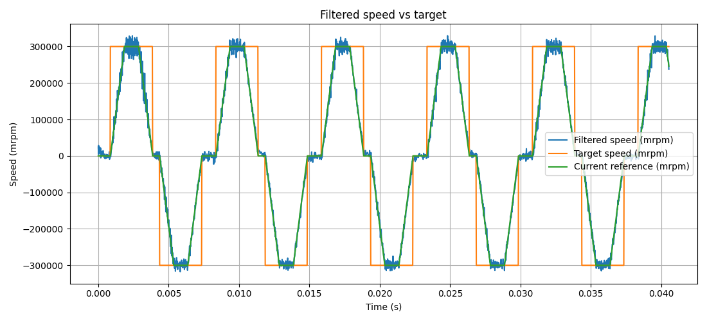
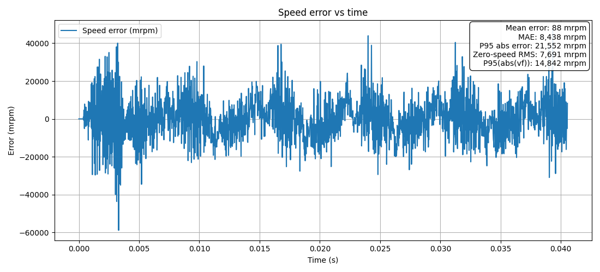
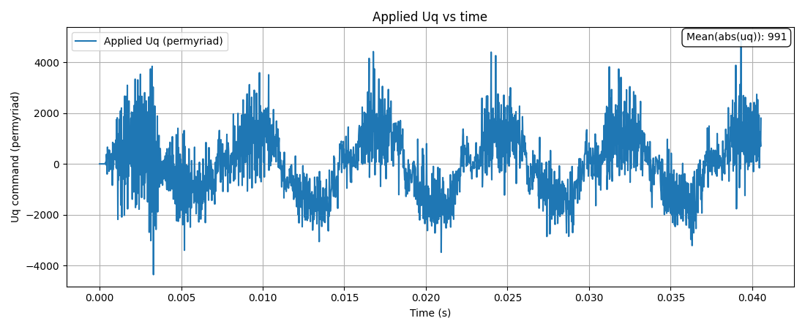

# Bare-Metal BLDC Speed Control on STM32F446RE

This project implements a bare-metal BLDC motor control application on an STM32F446RE (Nucleo-F446RE) using **C** and **CMSIS / register-level programming only**.  
No HAL, no LL, no RTOS, and no external motor-control library are used in the firmware.

The project focuses on a small but real closed-loop motor-control setup that stays readable, testable, and easy to inspect.  
It is intended as an educational and portfolio-oriented embedded control project, not as a production-ready motor drive.

## Project Goal

The main goal is to build and validate a readable sensored closed-loop speed-control stack for a small BLDC motor.

In the current project phase, the firmware:

1. measures mechanical angle from an **AS5600 analog output**
2. publishes a stable angle sample with wrap-aware handling
3. reconstructs electrical angle
4. estimates mechanical speed
5. runs a **PI speed controller**
6. applies a q-axis voltage command through **voltage-mode FOC**

This project is meant to demonstrate:

- bare-metal STM32 firmware design
- low-level peripheral driver development
- sensor integration
- control-loop integration
- runtime telemetry and offline result evaluation

## Current Status

The active application already supports:

- startup electrical alignment
- sensored closed-loop mechanical speed control
- AS5600 analog angle measurement through ADC
- filtered speed feedback
- PI speed control
- bidirectional speed-profile testing
- UART telemetry for runtime evaluation
- Python-based offline log plotting and metric calculation

What is working now:

- bare-metal board bring-up on **STM32 Nucleo-F446RE**
- TIM1 3PWM output stage
- SysTick-based scheduling utilities
- ADC-based AS5600 analog sensor path
- wrap-aware angle publishing
- long closed-loop logging sessions
- bidirectional trapezoidal speed-profile testing
- stable operation in the current nominal test range

## Validated Nominal Scope

The current validated nominal operating range for the presented results is:

- **bidirectional trapezoidal speed profile**
- **peak speed:** `±300 rpm`
- **controller gains:** `Kp = 2700`, `Ki = 6000`
- **bench test condition:** no external mechanical load

A higher peak speed (`±500 rpm`) has also been explored as a robustness test, but it is **not** treated as the nominal validated range in the current project stage.

## Hardware

Current bench setup:

- **MCU board:** STM32 Nucleo-F446RE
- **MCU family:** STM32F4
- **Motor:** 2208 gimbal BLDC motor
- **Sensor:** AS5600 magnetic angle sensor (analog output)
- **Power stage:** SimpleFOCMini board (**based on DRV8313**)
- **Host PC:** Windows 11 with STM32CubeIDE and Python log-analysis tools

Notes:

- the SimpleFOCMini board is used only as a **3-phase power stage**
- the firmware does **not** use the SimpleFOC software library
- no current shunt feedback is used in the current project phase

## Software and Runtime Configuration

Important design choices in the current version:

- **language:** C
- **style:** bare-metal
- **access level:** CMSIS / direct register access
- **IDE:** STM32CubeIDE
- **sensor sampling approach:** fixed-rate raw sampling with fixed publish interval
- **speed-loop update period:** `1 ms`
- **angle publish interval:** `500 us`
- **telemetry interval:** `100 ms`
- **runtime telemetry interface:** USART2
- **current PC-side UART logging setup:** `230400 baud`

This keeps the control flow deterministic and easy to inspect.

## Control Summary

From a control point of view, the firmware currently uses:

- sensored mechanical angle feedback
- speed estimation from published angle samples
- PI speed control
- voltage-mode FOC actuation

This means the project is already beyond open-loop commutation experiments and demonstrates a real embedded closed-loop control chain on hardware.

## Example Validation Plots

The figures below show one nominal bidirectional speed-profile run used for controller validation.

### Speed tracking

**What this plot shows**

The plot compares:

- the target speed profile
- the instantaneous controller reference
- the measured filtered motor speed

It shows stable bidirectional closed-loop speed tracking in the current nominal operating range of **±300 rpm**.

### Speed error

**What this plot shows**

This figure shows the speed-tracking error over time.  
It is useful for checking:

- steady-state tracking quality
- error growth during ramps
- behavior around zero-crossing and reversal points

### Uq command

**What this plot shows**

This figure shows the commanded q-axis voltage term used by the controller.  
It gives a quick view of:

- controller effort during acceleration and deceleration
- command activity near reversal points
- overall smoothness of the closed-loop response

## Runtime Telemetry

The normal runtime log uses compact `S,...` lines for long test sessions.

Current line format:

`S,timestamp_ms,mechanical_angle_deg_x10,velocity_filtered_mrpm,velocity_target_final_mrpm,velocity_reference_mrpm,velocity_error_mrpm,uq_command_permyriad`

For compact embedded logging, some fields use scaled integer units:

- `velocity_*_mrpm` = speed in milli-rpm
- `mechanical_angle_deg_x10` = mechanical angle in `0.1°`
- `uq_command_permyriad` = command in `0.01%`

This telemetry is used for:

- speed-tracking evaluation
- controller tuning
- profile comparison
- offline plotting and metric extraction in Python

## Repository Structure

- `Inc/`
  - `board/` board support and hardware mapping
  - `config/` application and project configuration
  - `drivers/` low-level bare-metal drivers
  - `motor/` motor-control related modules
- `Src/`
  - board, driver, and motor module implementations
  - `irq_handlers.c`
  - `main.c`
- `images/`
  - result plots used in the README

Main modules used by the active application include:

- GPIO / ADC / USART2 / SysTick / PWM TIM1 drivers
- `as5600_analog`
- `motor_electrical_angle`
- `motor_speed_feedback`
- `motor_speed_pi`
- `motor_foc_voltage`

## Build and Run

1. Open the project in **STM32CubeIDE**.
2. Build the firmware.
3. Flash it to the Nucleo-F446RE through **ST-Link**.
4. Connect the motor, sensor, and power stage carefully.
5. Open the USART2 log on the PC side and capture telemetry.
6. Use the Python analysis script to plot the results and compare runs.

## Configuration

Main application settings are in:

- `Inc/config/app_motor_test_config.h`

Project-wide settings are in:

- `Inc/config/project_config.h`

## Known Limitations

This version intentionally does **not** include:

- current sensing
- current control loop
- outer position loop
- feedforward compensation
- production-grade fault handling
- full user command interface
- loaded mechanical validation

The project should currently be viewed as a **working embedded motor-control prototype** with a documented tuning and validation process.

## Next Steps

Planned next work includes:

- preparing cleaner portfolio documentation
- adding more result plots and validation summaries
- documenting the hardware setup more clearly
- evaluating feedforward or more advanced control extensions in later phases
- exploring outer-loop position / trajectory control in a future stage

## Safety Notice

This firmware can drive real motor power hardware.

Use:

- current limiting
- safe supply settings
- correct wiring
- proper bench-test precautions

You are responsible for safe operation.

## License

This project is licensed under the Apache-2.0 License. See `LICENSE` for details.

## Contributing

Issues and pull requests are welcome.  
For larger changes, please open an issue first so the change can be discussed before implementation.